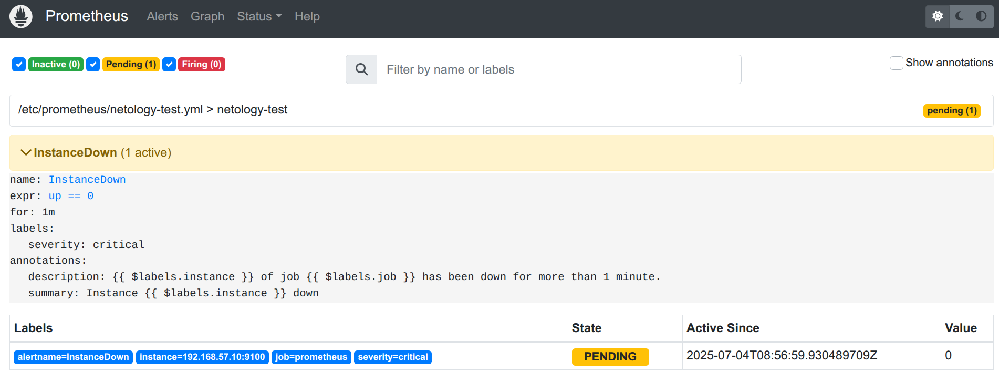
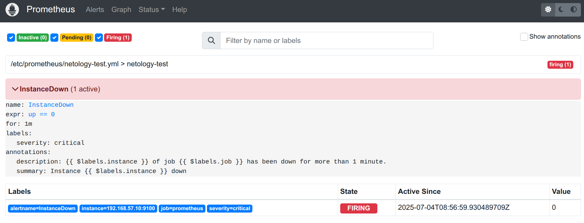
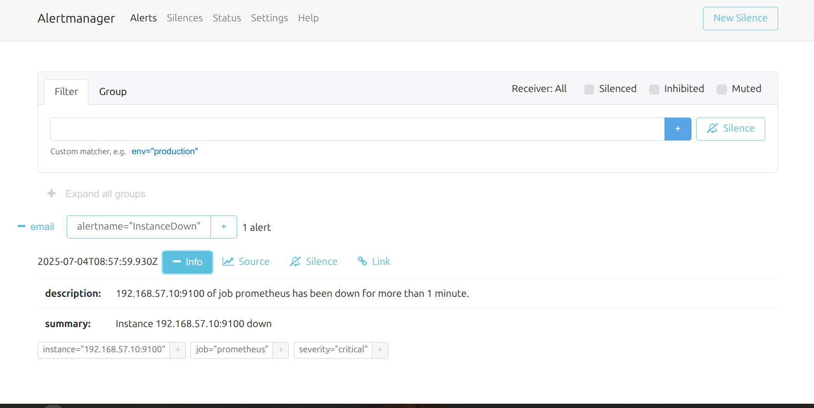
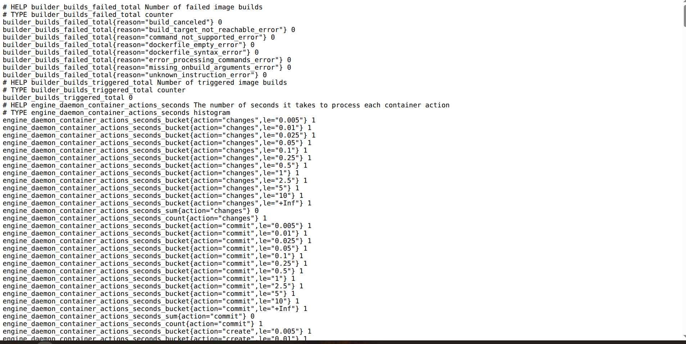
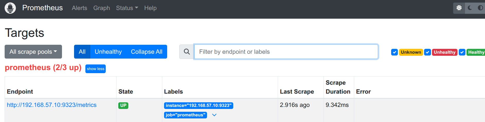
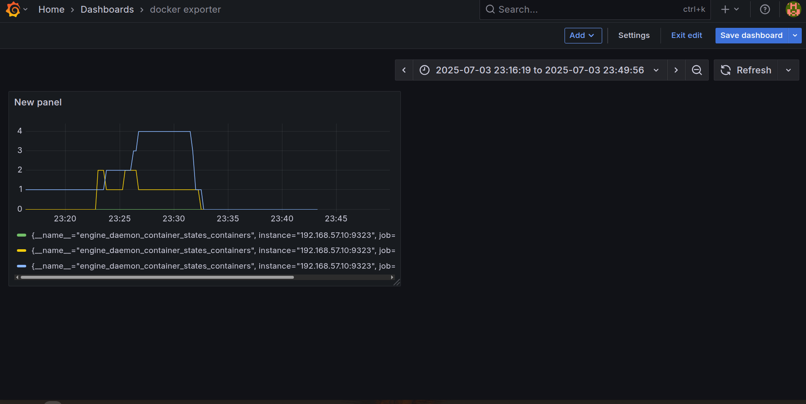

# Домашнее задание к занятию «Prometheus. Часть 2»  
**Автор:** Колыванов Антон

---

## Задание 1

Создайте файл с правилом оповещения, как в лекции, и добавьте его в конфиг Prometheus.

**Требования к результату:**  
Погасите node exporter, стоящий на мониторинге, и прикрепите скриншот раздела оповещений Prometheus, где оповещение будет в статусе `Pending`.

---

## Задание 2

Установите Alertmanager и интегрируйте его с Prometheus.

**Требования к результату:**  
Прикрепите скриншот Alerts из Prometheus, где правило оповещения будет в статусе `Firing`, и скриншот из Alertmanager,  
где будет видно действующее правило оповещения.

**Скриншот Alerts из Prometheus**  

**скриншот из Alertmanager**  

---

## Задание 3

Активируйте экспортёр метрик в Docker и подключите его к Prometheus.

**Требования к результату:**  
Приложите скриншот браузера с открытым эндпоинтом, а также скриншот списка таргетов из интерфейса Prometheus.

**Скриншот браузера с открытым эндпоинтом**  

**Скриншот списка таргетов из интерфейса Prometheus**  

---

## Задание 4

Создайте свой дашборд Grafana с различными метриками Docker и сервера, на котором он стоит.

**Требования к результату:**  
Приложите скриншот дашборда с метриками Docker.

**Скриншот дашборда с метриками Docker**  

